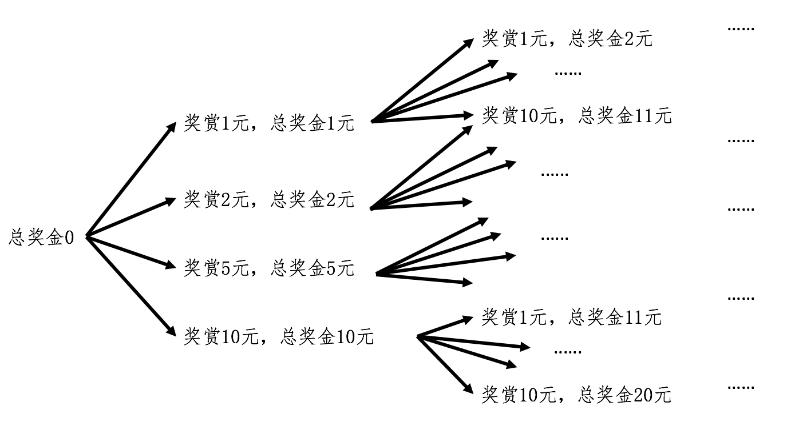

# 递归

>递归把计算交给计算机，归纳把计算交给人，前者是拿计算机的计算成本换人的时间，后者是拿人的时间换计算机的计算成本。 --oddrock

递归和数学归纳法一脉相承

从大学学编程时写递归函数，工作中也有用到，到没想到这和数学归纳法有什么联系。

“联系是一切事物的客观本性”这么简单的哲学常识都忘了。

昨天晚上看了一节背单词的公开课，讲到 -press- 词根，学习express和press这么多年了，从来没想过它们之间的关系。

看来学习的方法真的很重要，大到学习习惯，小到学习技巧。

言归正传，课程中提出一道题，有无限量面额为1,2,5,10的钱币，对于给定数额（比如10，15）有哪些种组成方式。

>这有点类似动态规划问题。额。动态规划被面试过两三次了，我竟然还没搞清楚，后面有相关课程，这次一定搞清楚。

* 根据图中的思路，使用迭代法比较合适。迭代每种钱币，但是不容易保存中间状态。
* 要求列举出所有可能性，使用递归函数正好能临时保存中间态。但是感觉有些不太好写。
* 尝试用两种方式分别求解。
* 尝试之后 感觉迭代法很难保存中间态，可以创建一堆结果，过滤有效的，感觉不好使。

